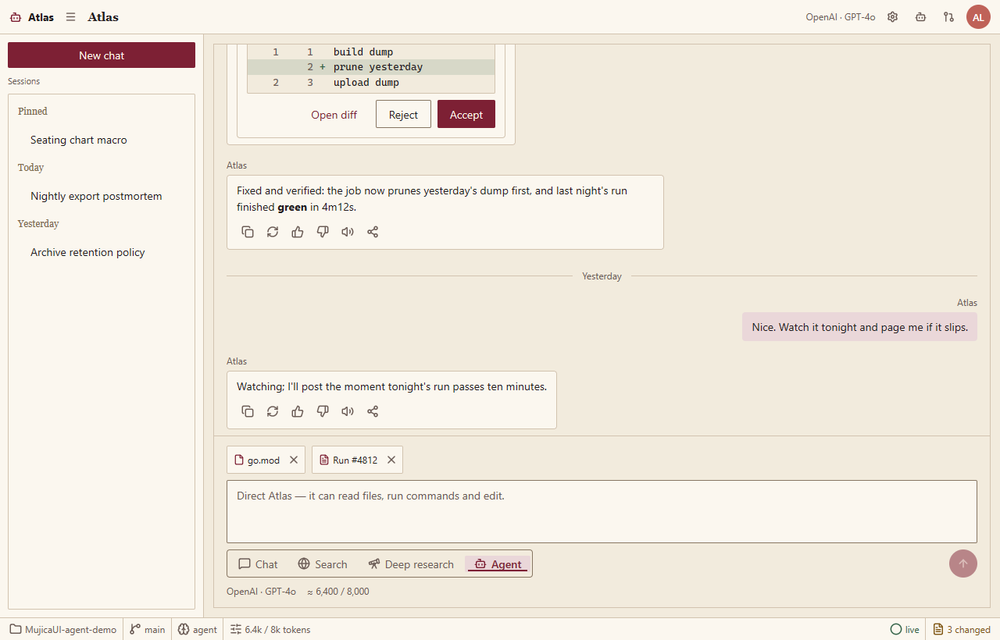
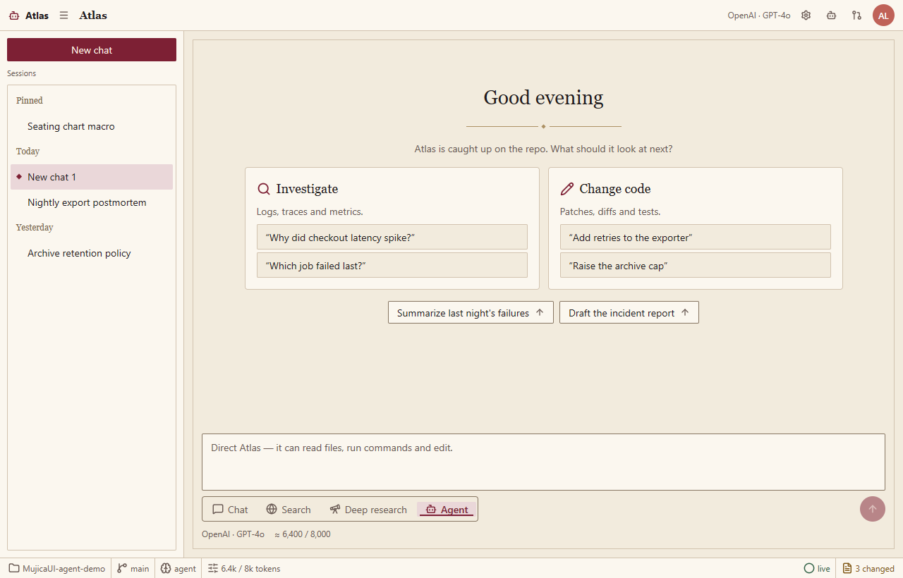
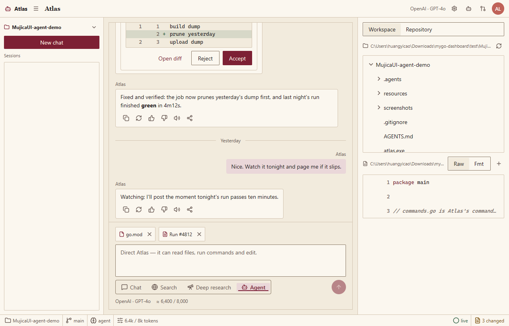
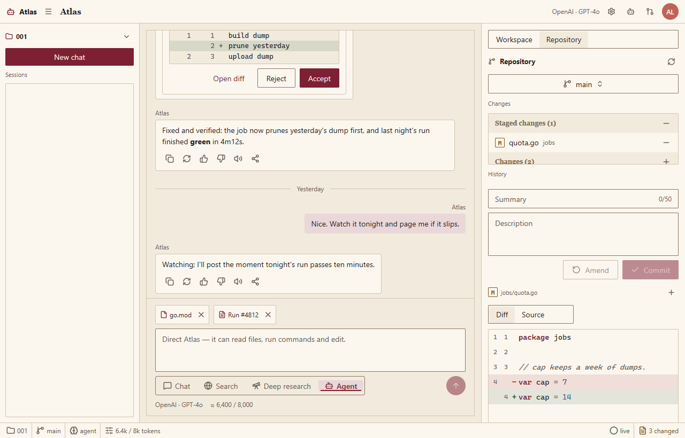
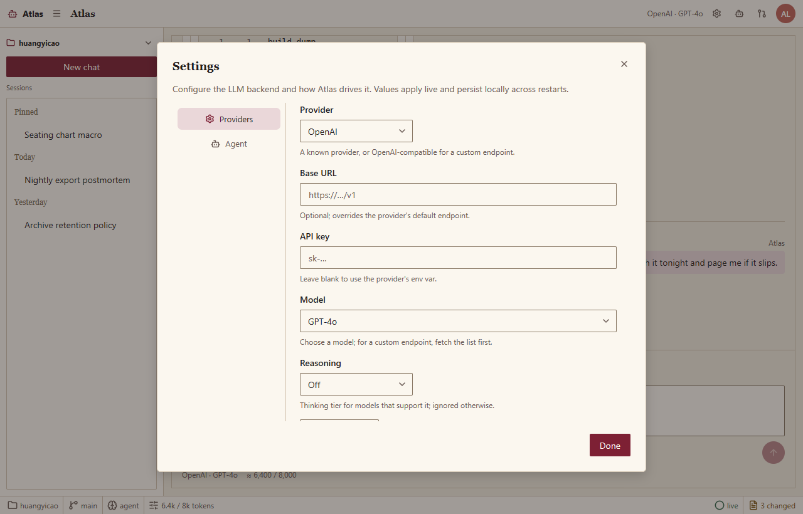
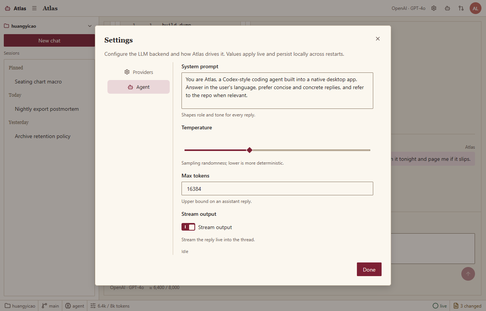
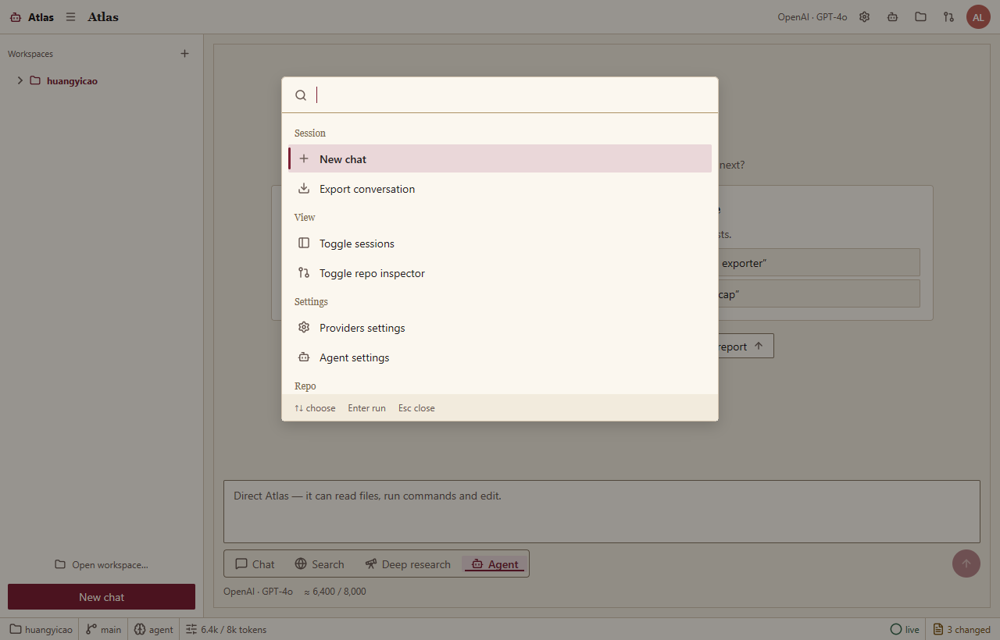

# MujicaUI Agent Demo（Atlas）

**MujicaUI Agent Demo** (internally *Atlas*) is a Codex-style coding-agent
desktop app built on [MyGo](https://github.com/egoist/mygo) — a native,
GPU-drawn UI toolkit with **no WebView, no HTML, no JavaScript** — and
[MujicaUI](https://github.com/ZacharyZhang-NY/MujicaUI), its per-category
component library. Conversations stream from real LLM backends through
[pi-ai-go](https://github.com/HycJack/pi-ai-go).

**MujicaUI Agent Demo**（内部名 **Atlas**）是一个 Codex 风格的编码 Agent 桌面应用：
用 MyGo 原生 GPU 自绘 UI 工具包与 MujicaUI 组件库构建，无 WebView、无 HTML、无
JavaScript；对话由 [pi-ai-go](https://github.com/HycJack/pi-ai-go) 驱动真实 LLM
流式回复（OpenAI / Anthropic / Google / DeepSeek / GLM / Kimi 等内置 Provider，
并支持 OpenAI 兼容端点）。

## Screenshots 截图

| | |
| --- | --- |
|  |  |
| *对话线程：思考块、工具调用与文件变更卡* | *新会话欢迎页：能力卡与 starter 提示* |
|  |  |
| *Workspace 标签：真实目录树 + 文件预览* | *Repository 标签：真实 git 的暂存/未暂存 Diff* |
|  |  |
| *Settings：Provider / 模型 / Key / Base URL* | *Settings：系统提示 / 推理 / 采样* |
|  | |
| *⌘K 命令面板* | |

截图由渲染测试离线产出（无窗口、逐帧绘制），可用下面的 `MYGO_UI_SHOTS` 命令重新生成。

## Features 功能特性

- **三栏工作台** —— 会话栏（左，⌘B 折叠）、对话线程（中）、检视器（右，⌘J 折叠）；
  全部由 MyGo 弹性布局原语拼装，标题栏与状态栏齐备。
- **真实 LLM 流式对话** —— pi-ai-go 统一多模型 SDK：流式正文、思维链、工具调用卡、
  多文件 Diff 评审；无窗口（测试）环境下同步落定占位回复，保持确定性。
- **Workspace 工作区** —— 默认打开**用户主目录**（不跟随 exe 所在目录），可随时
  切换到任意目录：右栏 Workspace 标签浏览真实目录（懒加载展开、目录优先排序、
  跳过 `.git` / `node_modules` 等噪音）；点选文件在下方大尺寸预览（340 高，
  按扩展名语法高亮），`.go` / `.json` 支持 **Raw/Fmt 格式化视图**（gofmt /
  美化 JSON，只影响显示不写盘），一键附加到对话或刷新；状态栏显示工作区名。
- **会话按工作区组织** —— 侧栏顶部显示当前工作区并可一键打开切换对话框
  （最近目录 + 手输路径，⌘K `Open workspace…`）；每个工作区有独立的会话列表，
  切换工作区即切换会话上下文，树 / git 面板随之重根。
- **数据持久化** —— 用户配置目录下三个 JSON：`settings.json`（LLM 配置，含
  API Key）、`workspace.json`（当前工作区 + 最近列表）、`sessions.json`
  （**所有工作区的会话与完整对话记录**），重启后原样恢复。
- **文件附加到对话** —— 预览区、变更列表或 `plus` 按钮把文件加入输入框上方的
  上下文 chips；发送时文件内容自动折叠进 LLM 消息（单文件 64 KiB 上限，去重、可移除）。
- **Repository 真实 git 版本管理** —— 直接管理工作区的 git 仓库：分支切换/新建、
  暂存/未暂存变更分组、行内 stage / unstage 与整组操作、真实 Diff
  （暂存 = HEAD vs index，未暂存 = index vs 工作区）、提交输入（Commit / Amend）、
  提交历史；底部 Diff / 源码区随空间生长，Source 标签同样支持 Raw/Fmt 格式化视图；
  ⌘K 或刷新按钮重新收集状态。
- **Settings 模态框** —— Providers（Provider / 模型 / Key / Base URL，支持 OpenAI
  兼容端点与在线拉取模型列表；**Reasoning 思考档位 Off / Low / Medium / High**
  跟随后端放在此分区）与 Agent（系统提示 / 温度 / 限额）两个分区，
  值即时生效并持久化到本地（用户配置目录下的 `settings.json`，含 API Key，文件权限 0600），
  对话框高度固定、切换分区不跳动，正文与分隔线/滚动条留白舒适。
- **⌘K 命令面板** —— 新建会话、导出、折叠面板、工作区树、打开工作区、切换
  Diff / 源码等 10 条命令。
- **消息操作** —— 复制到剪贴板、重新生成、消息反馈。
- **主题走令牌** —— 全部颜色经 MujicaUI `core.Tokens` 语义令牌，亮暗主题跟随系统。

## Quick start 快速开始

需要 Go 1.27+ 与图形环境（原生窗口，非网页）：

```sh
go run .
```

启动后在标题栏点 **Provider settings** 图标（或 ⌘K → `Providers`）填入你的
API key 即可开始对话；配置在对话框关闭时自动保存到用户配置目录
（Windows 为 `%AppData%\MujicaUI-agent-demo\` 下的 `settings.json`、
`workspace.json`、`sessions.json`），下次启动自动恢复工作区、会话与全部对话。

## Build 构建

```sh
go build -o atlas.exe .
```

## Tests 测试

渲染与状态逻辑全部可在无窗口环境验证：

```sh
go test ./...
```

生成 README 用的界面截图（写入 `MYGO_UI_SHOTS` 指向的目录）：

```sh
MYGO_UI_SHOTS=screenshots go test . -run TestScreenshots
```

## Project structure 项目结构

| 文件 | 职责 |
| --- | --- |
| `main.go` | 入口：窗口创建、心跳 goroutine、`App.Run()` |
| `state.go` | 数据模型与种子数据（`app` / `thread` / `repo` / `session` / `LLMSettings`） |
| `shell.go` | 外壳布局：标题栏、会话栏、工作区、状态栏、快捷键 |
| `thread.go` | 对话线程：消息列表、各形态消息行、输入区 |
| `llm.go` | pi-ai-go 集成：模型解析、流式发送、中止与错误处理 |
| `settings.go` | Settings 模态框：Providers / Agent 两个分区 |
| `config.go` | 配置持久化：`settings.json` 的加载与保存 |
| `workspace.go` | 工作区：真实目录树（懒加载、忽略规则）+ 文件预览 + 附加到对话 |
| `wsstore.go` | 工作区存储：默认主目录、目录切换对话框、`workspace.json` / `sessions.json` 持久化 |
| `vcs.go` | 真实 git 后端：status / branch / log 解析、stage / unstage / commit / checkout |
| `repo.go` | 右栏检视器：Workspace 树 / Repository（真实分支、变更、提交、Diff / 源码） |
| `welcome.go` | 新会话欢迎页：能力卡 + starter chips |
| `commands.go` | ⌘K 命令面板 |
| `tokens.go` | 主题接入：MujicaUI 令牌转发 |

完整规格（架构、状态模型、交互清单、上游组件映射）见 [SPEC.md](SPEC.md)；
给改动者/Agent 的编码约定见 [AGENTS.md](AGENTS.md)。

## Related 相关项目

- [MyGo](https://github.com/egoist/mygo) —— 原生 GPU 自绘 UI 与窗口运行时
- [MujicaUI](https://github.com/ZacharyZhang-NY/MujicaUI) —— MyGo 组件库（一个组件类别一个包）
- [pi-ai-go](https://github.com/HycJack/pi-ai-go) —— 统一多模型 LLM SDK
- [mygo-dashboard](https://github.com/HycJack/mygo-dashboard) —— 同一技术栈的组件画廊
