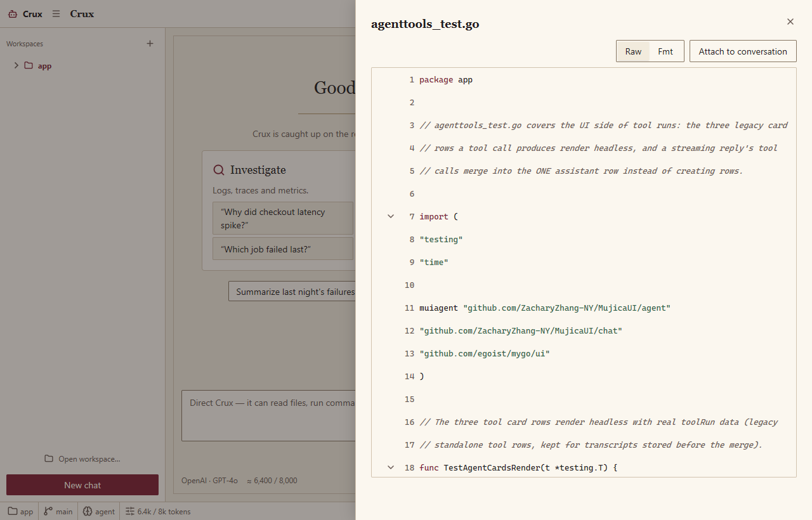

# Crux Agent（crux-agent）

**Crux** (module *crux-agent*) is a Codex-style coding-agent desktop app
built on [MyGo](https://github.com/egoist/mygo) — a native, GPU-drawn UI
toolkit with **no WebView, no HTML, no JavaScript** — and
[MujicaUI](https://github.com/ZacharyZhang-NY/MujicaUI), its per-category
component library. Conversations stream from real LLM backends through
[pi-ai-go](https://github.com/HycJack/pi-ai-go).

**Crux**（模块名 **crux-agent**，前身 MujicaUI Agent Demo / Atlas）是一个
Codex 风格的编码 Agent 桌面应用：用 MyGo 原生 GPU 自绘 UI 工具包与 MujicaUI
组件库构建，无 WebView、无 HTML、无 JavaScript；对话由
[pi-ai-go](https://github.com/HycJack/pi-ai-go) 驱动真实 LLM 流式回复
（OpenAI / Anthropic / Google / DeepSeek / GLM / Kimi 等内置 Provider，
并支持 OpenAI 兼容端点）。

代码按**三层**组织：`internal/store`（数据层：落盘结构与原子写，不依赖 UI）、
`internal/engine`（逻辑层：agent 循环与工具集，回调式事件，不依赖 UI）、
`internal/app`（UI 层：状态、渲染与薄适配器）；根目录 `main.go` 只做引导。

## Screenshots 截图

| | |
| --- | --- |
|  |  |
| *对话线程：思考块、工具调用与文件变更卡* | *新会话欢迎页：能力卡与 starter 提示* |
|  |  |
| *Workspace 标签：真实目录树* | *代码抽屉：大尺寸查看 + Raw/Fmt 格式化* |
|  |  |
| *Repository 标签：真实 git 的暂存/未暂存 Diff* | *Repository 标签：工作区文件源码* |
|  |  |
| *Settings：Provider / 模型 / Key / Base URL / Reasoning 分档* | *Settings：系统提示 / 采样* |
|  | |
| *⌘K 命令面板* | |

截图由渲染测试离线产出（无窗口、逐帧绘制），可用下面的 `MYGO_UI_SHOTS` 命令重新生成。

## Features 功能特性

- **三栏工作台** —— 会话树（左，⌘B 折叠）、对话线程（中）、检视器（右，⌘J 折叠）；
  全部由 MyGo 弹性布局原语拼装，标题栏与状态栏齐备。
- **真实 agent 循环（工具执行）** —— pi-ai-go 的 `agent.AgentLoop`（经
  `internal/engine` 回调式封装）：**一次回复一个消息气泡**——等待首 token 时
  显示打字点；思考与工具调用折叠进可收起的块（`bash` 终端卡：命令 / 输出 /
  退出码 / 耗时，可点停止；`read_file` 工具调用卡；`write_file` before/after
  评审卡），正文流式输出、完成后按 **可选中 Markdown 渲染**（标题 / 有序列表 /
  表格 / 代码块，全部支持鼠标拖选复制）；每条消息带**复制按钮与时间**，助理回复
  可**一键重新生成**；无窗口（测试）环境下同步落定占位回复，保持确定性。
- **Workspace 工作区** —— 默认打开**用户主目录**（不跟随 exe 所在目录）；标题栏
  `folder` 按钮**直达右侧目录树面板**；Workspace 标签浏览真实目录（懒加载展开、
  目录优先排序、跳过 `.git` / `node_modules` 等噪音）；**点击文件滑出右侧大抽屉**
  （720 宽、内容填满）查看源码：按扩展名语法高亮，`.go` / `.json` 支持 **Raw/Fmt
  格式化视图**（gofmt / 美化 JSON，只影响显示不写盘）。
- **会话树按工作区分组** —— 侧栏是一棵两级树：第一层是 workspace 目录名
  （当前根自动展开、带会话数徽标），会话嵌套在各自工作区下；点 workspace 行
  展开/折叠，点会话打开（属于其它工作区时自动先切换过去）；末行 "Open workspace…"
  手输入口 + `New chat` 按钮。**首跑无任何演示会话**——空树 + 欢迎页，与真实
  agent 控制台一致。
- **数据持久化** —— 用户**家目录**下 `~/.crux-agent/`（Windows 即
  `C:\Users\<你>\.crux-agent\`，**不是** `%AppData%`，也不是 exe 所在目录）：
  `settings.json`（LLM 配置，含 API Key）、`workspace.json`（当前工作区 + 最近列表）、
  `sessions.json`（会话**索引**）+ **每个会话一个转录文件** `sessions\<id>.json`
  （打开会话时懒加载，保存只写索引 + 有改动的转录，长对话不再互相拖累）；所有写入走
  **临时文件 + 原子替换**，遇到坏 ACL 的旧文件自动删除重写（修复 "Access is denied"）；
  旧版存在 `%AppData%\MujicaUI-agent-demo\` 或 `~/.mujicaui-agent-demo/` 的数据启动时
  自动迁移（不覆盖新文件，旧目录保留作备份）。重启后原样恢复。
- **文件附加到对话** —— **在目录树的文件上右键 → "Add to conversation"**（菜单里
  还有 "Open in viewer" / "Copy path"），或用代码抽屉 / 变更列表的按钮把文件加入
  输入框上方的上下文 chips；发送时文件内容自动折叠进 LLM 消息（单文件 64 KiB 上限，
  去重、可移除）。
- **Repository 真实 git 版本管理** —— 直接管理工作区的 git 仓库：分支切换/新建、
  暂存/未暂存变更分组、行内 stage / unstage 与整组操作、真实 Diff
  （暂存 = HEAD vs index，未暂存 = index vs 工作区）、提交输入（Commit / Amend）、
  提交历史；底部 Diff / 源码区随空间生长，Source 标签同样支持 Raw/Fmt 格式化视图；
  ⌘K 或刷新按钮重新收集状态。
- **Settings 模态框** —— Providers（Provider / 模型 / Key / Base URL，支持 OpenAI
  兼容端点与在线拉取模型列表；**Reasoning 思考档位 Off / Low / Medium / High**
  跟随后端放在此分区）与 Agent（系统提示 + 固定工具集说明；**不暴露温度 / 限额 /
  流式开关**，采样走 provider 默认）两个分区，值即时生效并**在对话框打开期间实时
  落盘**（改完直接关窗口/杀进程也不丢；`settings.json` 含 API Key，文件权限 0600），
  对话框高度固定、切换分区不跳动，正文与分隔线/滚动条留白舒适。
- **⌘K 命令面板** —— 新建会话、导出、折叠面板、工作区树、打开工作区、切换
  Diff / 源码等 10 条命令。
- **消息操作** —— 复制到剪贴板、重新生成、消息反馈。
- **主题走令牌** —— 全部颜色经 MujicaUI `core.Tokens` 语义令牌，亮暗主题跟随系统。

## Quick start 快速开始

需要 Go 1.27+ 与图形环境（原生窗口，非网页）：

```sh
go run .
```

启动后在标题栏点 **Provider settings** 图标（或 ⌘K → `Providers`）填入你的
API key 即可开始对话；配置在对话框打开期间**实时保存**到用户家目录
（`~/.crux-agent/`，Windows 即 `C:\Users\<你>\.crux-agent\` 下的
`settings.json`、`workspace.json` 与会话存储 `sessions.json` + `sessions\`），
下次启动自动恢复工作区、会话与全部对话。

## Build 构建

```sh
go build -o crux.exe .
```

## Tests 测试

渲染与状态逻辑全部可在无窗口环境验证（UI 层 + 三个内部包各自有测试）：

```sh
go test ./...
```

生成 README 用的界面截图（写入 `MYGO_UI_SHOTS` 指向的目录）：

```sh
MYGO_UI_SHOTS=screenshots go test ./internal/app -run TestScreenshots
```

## Project structure 项目结构

三层结构：数据（`internal/store`）/ 逻辑（`internal/engine`）/ UI（`internal/app`），
根目录只剩引导与文档。

| 路径 | 职责 |
| --- | --- |
| `internal/store/` | **数据层**（无 UI 依赖）：家目录 `~/.crux-agent/` 布局、旧目录迁移链（`%AppData%` → `~/.mujicaui-agent-demo` → `~/.crux-agent`）、settings / workspace / 会话索引 / 每会话转录的落盘结构与原子写（唯一临时名 + 重试 + 兜底直写） |
| `internal/engine/` | **逻辑层**（无 UI 依赖）：pi-ai-go agent 循环封装（回调式流事件）、`bash` / `read_file` / `write_file` 工具集、模型解析与 Reasoning 档位、连接测试、provider 注册表门面 |
| `internal/md/` | 纯 Markdown 解析（块级结构，供 UI 层渲染为可选中元素） |
| `internal/app/` | **UI 层**：`app.go` 引导（迁移/恢复状态/窗口/心跳）、`state.go` 状态模型、`shell.go` 外壳与侧栏、`thread.go` 对话线程（一条回复一个气泡）、`llm.go` 引擎适配器、`persist.go` 持久化胶水、`settings.go` 设置模态框、`workspace.go` 目录树、`drawer.go` 代码抽屉、`mdview.go` 可选中 Markdown 渲染、`vcs.go` 真实 git 后端、`repo.go` 检视器、`welcome.go` 欢迎页、`commands.go` ⌘K 面板、`wsdialog.go` 工作区对话框、`tokens.go` 主题转发 |
| `main.go` | 入口：调用 `app.Run()` |
| `mygo.json` | 打包元数据 |
| `resources/icon.png` | 应用图标 |

完整规格（架构、状态模型、交互清单、上游组件映射）见 [SPEC.md](SPEC.md)；
给改动者/Agent 的编码约定见 [AGENTS.md](AGENTS.md)。

## Related 相关项目

- [MyGo](https://github.com/egoist/mygo) —— 原生 GPU 自绘 UI 与窗口运行时
- [MujicaUI](https://github.com/ZacharyZhang-NY/MujicaUI) —— MyGo 组件库（一个组件类别一个包）
- [pi-ai-go](https://github.com/HycJack/pi-ai-go) —— 统一多模型 LLM SDK
- [mygo-dashboard](https://github.com/HycJack/mygo-dashboard) —— 同一技术栈的组件画廊
