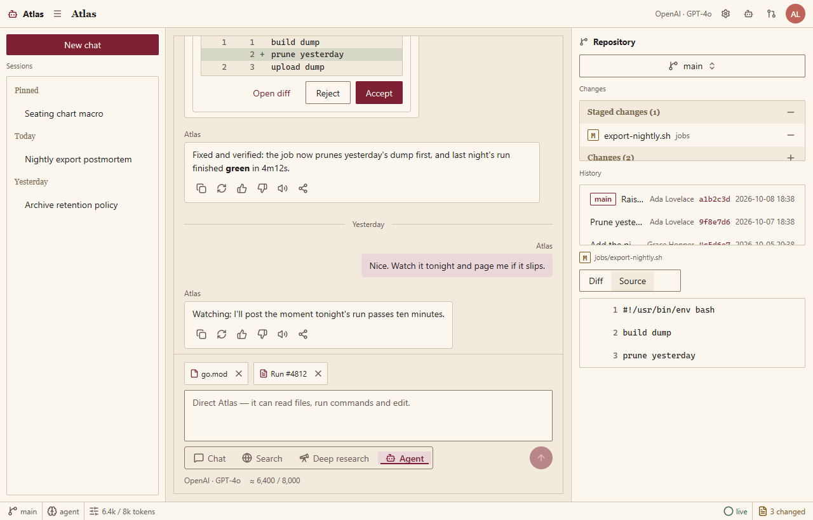

# MujicaUI Agent Demo（Atlas）

**MujicaUI Agent Demo** (internally *Atlas*) is a Codex-style coding-agent
desktop app built on [MyGo](https://github.com/egoist/mygo) — a native,
GPU-drawn UI toolkit with **no WebView, no HTML, no JavaScript** — and
[MujicaUI](https://github.com/ZacharyZhang-NY/MujicaUI), its per-category
component library. Conversations stream from real LLM backends through
[pi-ai-go](https://github.com/HycJack/pi-ai-go).

**MujicaUI Agent Demo**（内部名 **Atlas**）是一个 Codex 风格的编码 Agent 桌面应用：
用 MyGo 原生 GPU 自绘 UI 工具包与 MujicaUI 组件库构建，无 WebView、无 HTML、无
JavaScript；对话由 [pi-ai-go](https://github.com/HycJack/pi-ai-go) 驱动真实 LLM
流式回复（OpenAI / Anthropic / Google / DeepSeek / GLM / Kimi 等内置 Provider，
并支持 OpenAI 兼容端点）。

## Screenshots 截图

| | |
| --- | --- |
|  |  |
| *对话线程：思考块、工具调用与文件变更卡* | *新会话欢迎页：能力卡与 starter 提示* |
|  |  |
| *仓库检视器：工作区 Diff* | *仓库检视器：文件源码视图* |
|  |  |
| *Settings：Provider / 模型 / Key / Base URL* | *Settings：系统提示 / 推理 / 采样* |
|  | |
| *⌘K 命令面板* | |

截图由渲染测试离线产出（无窗口、逐帧绘制），可用下面的 `MYGO_UI_SHOTS` 命令重新生成。

## Features 功能特性

- **三栏工作台** —— 会话栏（左，⌘B 折叠）、对话线程（中）、仓库检视器（右，⌘J 折叠）；
  全部由 MyGo 弹性布局原语拼装，标题栏与状态栏齐备。
- **真实 LLM 流式对话** —— pi-ai-go 统一多模型 SDK：流式正文、思维链、工具调用卡、
  多文件 Diff 评审；无窗口（测试）环境下同步落定占位回复，保持确定性。
- **Settings 模态框** —— Providers（Provider / 模型 / Key / Base URL，支持 OpenAI
  兼容端点与在线拉取模型列表）与 Agent（系统提示 / 推理层级 / 温度 / 限额）两个分区，
  值即时生效、仅存内存。
- **仓库检视器** —— 分支切换、变更列表、提交历史、Diff / 源码分段视图（mock 数据，
  只读演示）。
- **⌘K 命令面板** —— 新建会话、导出、折叠面板、切换 Diff / 源码等 7 条命令。
- **消息操作** —— 复制到剪贴板、重新生成、消息反馈。
- **主题走令牌** —— 全部颜色经 MujicaUI `core.Tokens` 语义令牌，亮暗主题跟随系统。

## Quick start 快速开始

需要 Go 1.27+ 与图形环境（原生窗口，非网页）：

```sh
go run .
```

启动后在标题栏点 **Provider settings** 图标（或 ⌘K → `Providers`）填入你的
API key 即可开始对话；配置仅保存在内存中，不会写磁盘。

## Build 构建

```sh
go build -o atlas.exe .
```

## Tests 测试

渲染与状态逻辑全部可在无窗口环境验证：

```sh
go test ./...
```

生成 README 用的界面截图（写入 `MYGO_UI_SHOTS` 指向的目录）：

```sh
MYGO_UI_SHOTS=screenshots go test . -run TestScreenshots
```

## Project structure 项目结构

| 文件 | 职责 |
| --- | --- |
| `main.go` | 入口：窗口创建、心跳 goroutine、`App.Run()` |
| `state.go` | 数据模型与种子数据（`app` / `thread` / `repo` / `session` / `LLMSettings`） |
| `shell.go` | 外壳布局：标题栏、会话栏、工作区、状态栏、快捷键 |
| `thread.go` | 对话线程：消息列表、各形态消息行、输入区 |
| `llm.go` | pi-ai-go 集成：模型解析、流式发送、中止与错误处理 |
| `settings.go` | Settings 模态框：Providers / Agent 两个分区 |
| `repo.go` | 仓库检视器：分支、变更、提交、Diff / 源码 |
| `welcome.go` | 新会话欢迎页：能力卡 + starter chips |
| `commands.go` | ⌘K 命令面板 |
| `tokens.go` | 主题接入：MujicaUI 令牌转发 |

完整规格（架构、状态模型、交互清单、上游组件映射）见 [SPEC.md](SPEC.md)；
给改动者/Agent 的编码约定见 [AGENTS.md](AGENTS.md)。

## Related 相关项目

- [MyGo](https://github.com/egoist/mygo) —— 原生 GPU 自绘 UI 与窗口运行时
- [MujicaUI](https://github.com/ZacharyZhang-NY/MujicaUI) —— MyGo 组件库（一个组件类别一个包）
- [pi-ai-go](https://github.com/HycJack/pi-ai-go) —— 统一多模型 LLM SDK
- [mygo-dashboard](https://github.com/HycJack/mygo-dashboard) —— 同一技术栈的组件画廊
